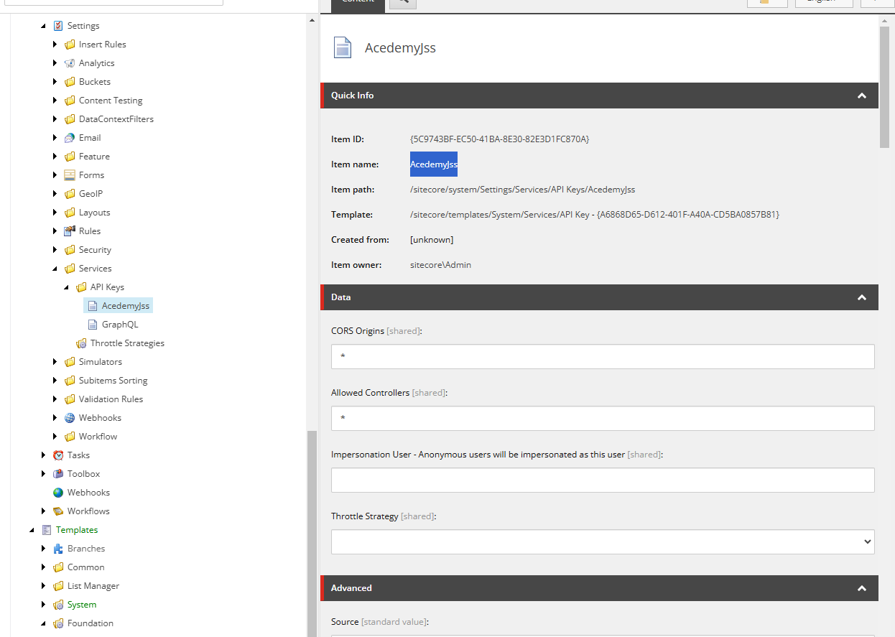
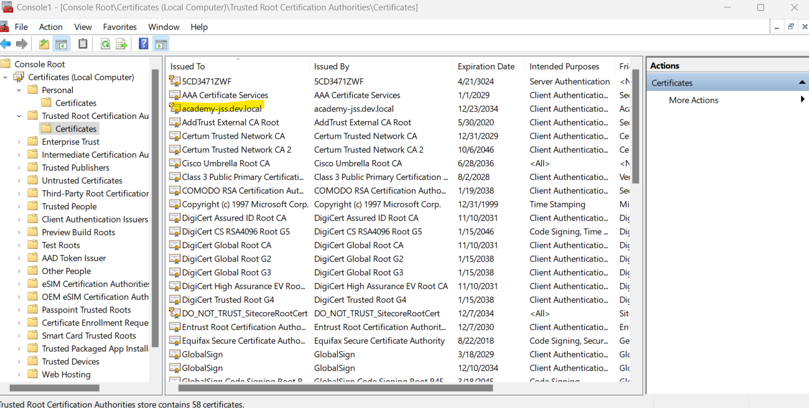
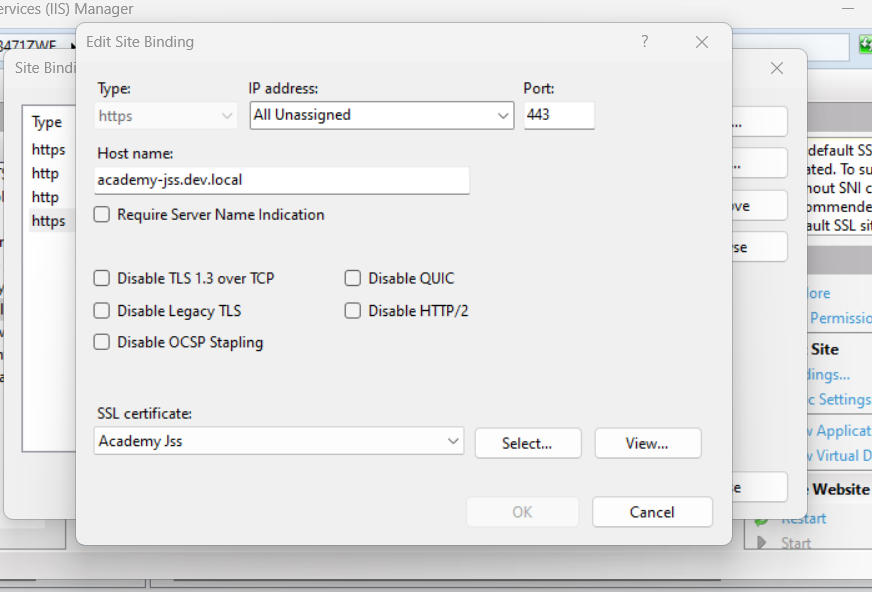
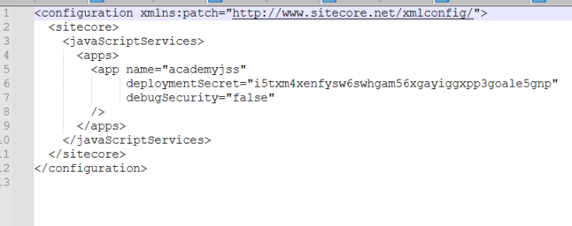
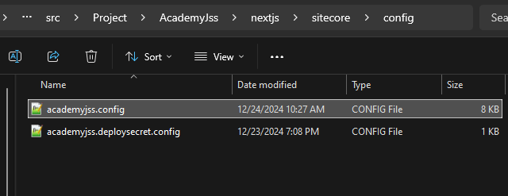
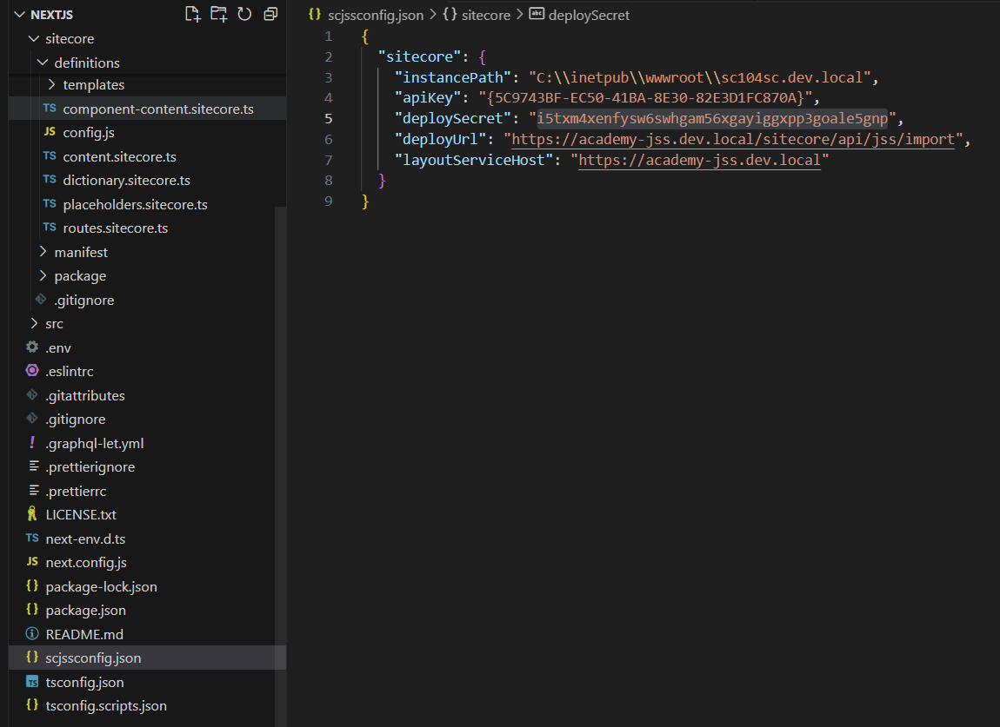
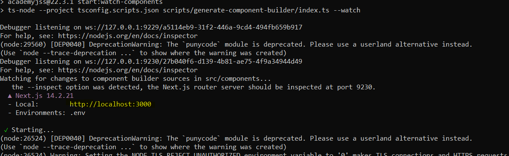

# Lab 1 : Next.js JSS Site Configuration
    
    - Install/Setup prerequisites for Jss 
    - Install jss app
    - Setup and deploy jss app configs
    - Test jss disconnected mode
    
  ## Prerequisites 
 

 1. Instlla node.js https://nodejs.org/en/download/prebuilt-installer
 2. Download **Sitecore Headless Rendering 22.0.0** [Sitecore Headless Services for Sitecore XP](https://scdp.blob.core.windows.net/downloads/Sitecore%20Headless%20Rendering/22x/Sitecore%20Headless%20Rendering%202200/Secure/Sitecore%20Headless%20Services%20Server%20XP%2022.0.11.zip)
 3. Install sitecore package 
 4. Create local folder structure for code `\courses\Academy-jss\src\Project\AcademyJss`
5. Create Sitecore new Api key 
		 -   Navigate to – `/sitecore/system/Settings/Services/API Keys`
		 -  Create a new API Key e.g.:- **AcedemyJss**
		 - API key here is **Item ID**
		 
		 
		 
		 

### Create a custom binding
1. create a self signed certificate with a custom domain name in this case – **academy-jss.dev.local**
>  New-SelfSignedCertificate -CertStoreLocation C:\certificates -DnsName  "academy-jss.dev.local" -FriendlyName "Academy Jss"  -NotAfter (Get-Date).AddYears(10)
2. Run **mmc** and check certificate exist in *Personal* and *Trusted Root* folders

3. Setup IIS binding and choose new certificate

   4. Add domain to the host file – **academy-jss.dev.local**

##  Jss Installation

 1. Navigate to folder `\courses\Academy-jss\src\Project\AcademyJss`
 2. Run powershell as administrator
 3.  Run command

> **npx create-sitecore-jss**

Is your Sitecore instance on this machine or accessible via network share? [y/n]: y  
Path to the Sitecore folder (e.g. c:\inetpub\wwwroot\my.siteco.re):  
Invalid input.  
Path to the Sitecore folder (e.g. C:\inetpub\wwwroot\sc104sc.dev.local): C:\inetpub\wwwroot\xp102sc.dev.local  
Sitecore hostname (e.g. academy-jss.dev.local; see /sitecore/config; ensure added to hosts): academy-jss.dev.local  
Invalid input. Must start with http(s)  
Sitecore hostname (e.g. http://academy-jss.dev.local; see /sitecore/config; ensure added to hosts): **https://academy-jss.dev.local** 
Sitecore import service URL [https://academy-jss.dev.local/sitecore/api/jss/import]: **https://academy-jss.dev.local/sitecore/api/jss/import**  
Sitecore API Key (ID of API key item): **{2318A20A-6DF1-4AB8-B49E-F933A3B79160}**  
Please enter your deployment secret (32+ random chars; or press enter to generate one):

Deployment secret– Leave this blank as this will generate new secret key

4. Deployment secret key is generate and stored in **<<jss development folder>>\sitecore\config\academyjss.deploysecret.config**

JSS connection settings saved to **scjssconfig.json**

5. Connection and the deployment secret is created, now this needs to be deployed to Sitecore instance so the JSS app is able to establish a connection with Sitecoore

To deploy the config setting deploy the config to Sitecore instance

Powershell
> **jss deploy config**

6. Run command

>  **jss start**
7. Open disconnected next js app for testing localhost:3000 by default

