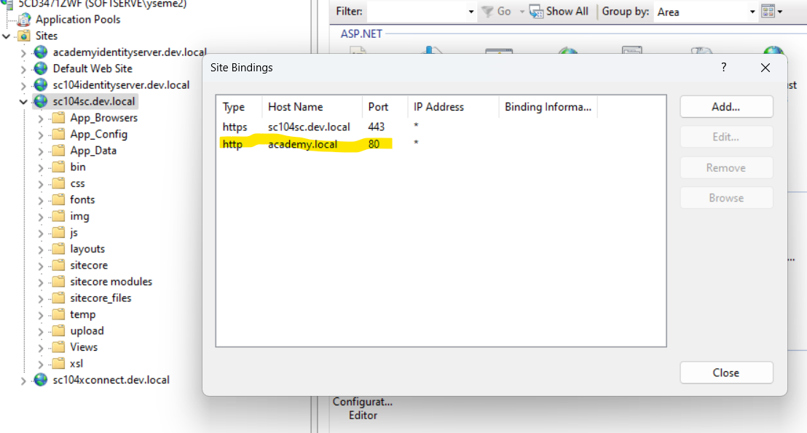
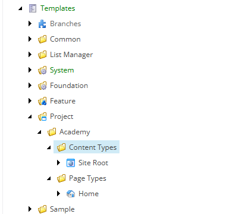
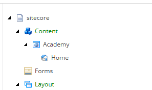

# Lab 1 :Site Configuration

-   Set up a new Sitecore site with a unique hostname.
-   Configure the site definition in the file and Sitecore's content tree.


# Solution structure

```
|   SoftServe.Academy.MVC.sln
|
\---src
    +---Feature
    +---Foundation
    \---Project
        \---Academy
            \---code
                |   packages.config
                |   SoftServe.Academy.Project.Website.csproj
                |   Web.config
                |   Web.Debug.config
                |   Web.Release.config
                |
                +---App_Config
                |   \---Include
                |       \---Project
                |               SoftServe.Academy.Project.Website.config
                |
                +---Properties
                |   |   AssemblyInfo.cs
                |   |
                |   \---PublishProfiles
                |           Local.pubxml
                |
                \---Views
                        Web.config
                        Web.Debug.config
                        Web.Release.config

```

 1. Open IIS and add cusrom binding (eg. academy.local)

 
 
 2. Add host url to hosts.file **C:\Windows\System32\drivers\etc\hosts.file**
127.0.0.1	academy.local
 3. Add custom config with site configs **SoftServe.Academy.Project.Website.config**
4. Setup **Home Page** Template




5. Setup **Site Root** Template




6. Check/Preview Home item


