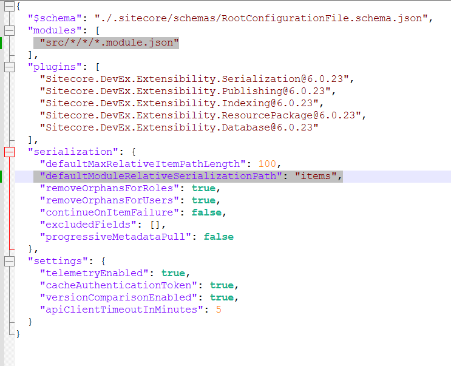

# Lab 2 :Serialization Setup

-  Install and configure Sitecore serialization tools.
-  Add **Foundation.Serialization** project, setup **Foundation.Serialization.module.json**  for base serialization setup (Add additional folders for Serialization in content tree(media Project, Foundation., Feature) 
-  Add **Academy.module.json** and setup Project items
-  Serialize initial site configuration and templates to source control.

# Sitecore CLI installation

 1. Read documentation [ Sitecore Content Serialization](https://doc.sitecore.com/xp/en/developers/latest/developer-tools/sitecore-content-serialization.html)
 2. Install CLI with powershell

>     cd <project folder>
>     dotnet new tool-manifest
>     dotnet nuget add source -n Sitecore https://nuget.sitecore.com/resources/v3/index.json]
>     dotnet tool install Sitecore.CLI
3. Download and intall Sitecore package **Sitecore Management Services Module ZIP Package**  [Link](https://developers.sitecore.com/downloads/Sitecore_CLI/6x/Sitecore_CLI_6023)
4. Use Sitecore serialization tool for connect to sitecore instance
> dotnet sitecore init

> dotnet sitecore login --authority https://sc104identityserver.dev.local --cm https://sc104sc.dev.local --allow-write true

  ***replace authority and cm with own values***

5. Update **sitecore.json** with proper **module** and **defaultModuleRelativeSerializationPath**

6. Setup **Foundation.Serialization** and **Project.Academy** (see code reference) and pull templates

7. Add nessesary folders for Academy and run command
>     dotnet sitecore ser pull